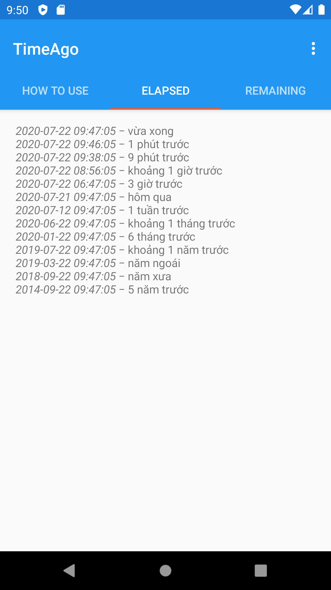
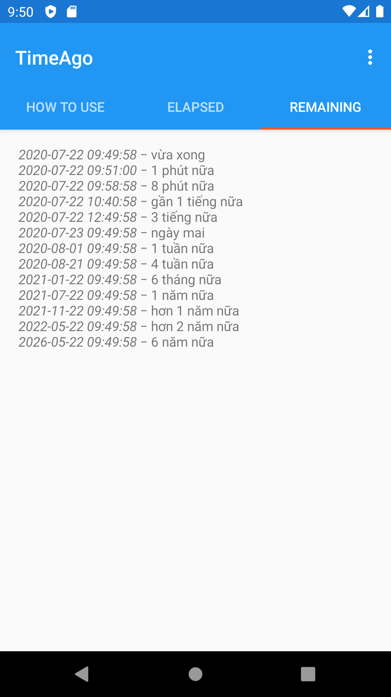

# TimeAgo

[](https://jitpack.io/#quanghd96/timeago)

Simple java library for displaying dates as relative time ago language.

## Examples:
- 4 days ago
- 15 years ago
- a minute ago
- just now

   

## Usage:

### Import as a dependency:
```
allprojects {
    repositories {
        ...
        maven { url 'https://jitpack.io' }
    }
}
```
```
implementation 'com.github.quanghd96:timeago:5.0.0'
```

### Use it in your code:

```java
String text = TimeAgo.using(timeInMillis);
```

Where _timeInMillis_, based on current date and time, is defined like 

```java
/* You can use java.util.Calendar.getInstance().getTimeInMillis()*/
/* Also, with java 8, java.time.Instant.now().toEpochMilli() */

long timeInMillis = System.currentTimeMillis();
```

### With Specific Locale (by language tag):

For specific language usage, use _TimeAgoMessages_:

```java
Locale LocaleBylanguageTag = Locale.forLanguageTag("es"); 
TimeAgoMessages messages = new TimeAgoMessages.Builder().withLocale(LocaleBylanguageTag).build();

String text = TimeAgo.using(timeInMillis, messages);
```

Languages supported: Vietnamese (vi), English (en), Spanish (es), Dutch (nl), German (de), French (fr), Italian (it), Portuguese (pt), Indonesian (id), Czech (cs), Arabic (ar), Chinese (zh).

### License

```
Copyright 2016

Licensed under the Apache License, Version 2.0 (the "License");
you may not use this file except in compliance with the License.
You may obtain a copy of the License at

    http://www.apache.org/licenses/LICENSE-2.0

Unless required by applicable law or agreed to in writing, software
distributed under the License is distributed on an "AS IS" BASIS,
WITHOUT WARRANTIES OR CONDITIONS OF ANY KIND, either express or implied.
See the License for the specific language governing permissions and
limitations under the License.
```
